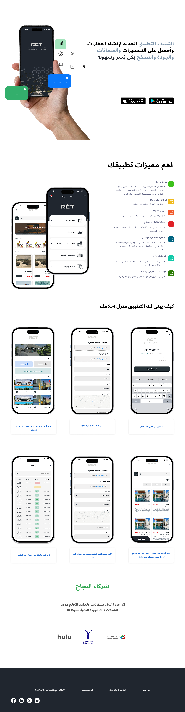
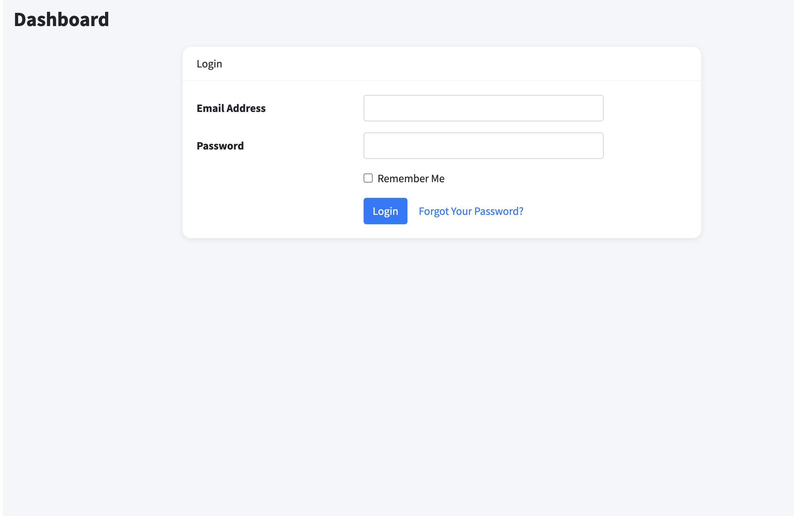
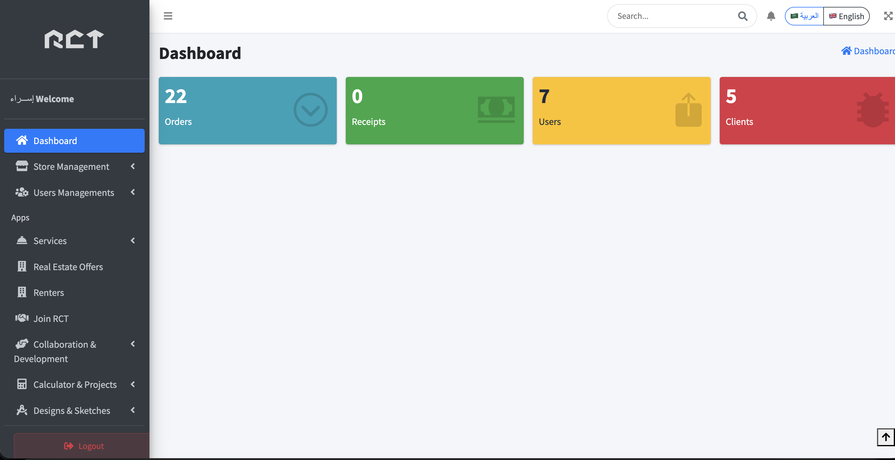
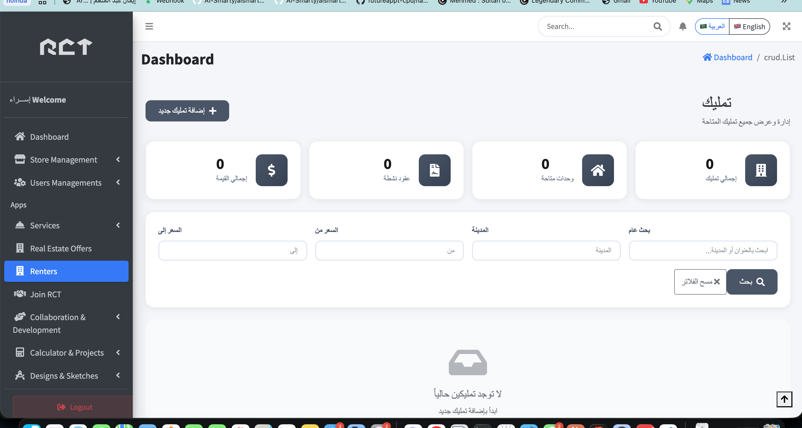
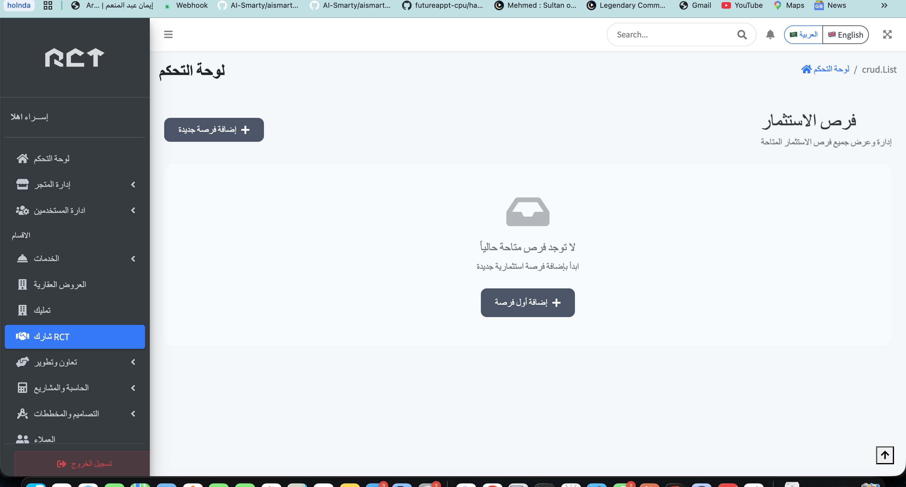

# RCT Real Estate & Services Platform

RCT is a Laravel-based web platform for managing real estate services, property opportunities, client requests, sellers, payments, notifications, and administrative operations.

The repository contains the web/admin backend implementation. The mobile application was handled as a Flutter product in a separate scope, while this project provides the web dashboards and API layer used to support mobile-facing workflows.

## Project Overview

This project was built to support a real estate and service-management workflow with multiple user journeys:

- Public landing pages and localized informational pages.
- Admin dashboard for managing platform data and operations.
- Seller dashboard for products, categories, coupons, carts, and orders.
- API endpoints for mobile and external clients.
- Property management for raw lands, old buildings, residential buildings, opportunities, renters, and related contracts.
- Order and payment flows with callback handling.
- Notifications, OTP, authentication, roles, and permissions.

## Main Features

- Authentication and authorization using Laravel authentication, Sanctum, and role/permission management.
- Admin management for users, roles, permissions, clients, orders, categories, services, sellers, coupons, and content pages.
- Real estate modules for raw lands, old buildings, residential buildings, opportunities, renters, renter contracts, and installments.
- Service ordering modules for builds, floors, areaspaces, sketches, designs, receipts, and preferable requests.
- Seller commerce area with products, carts, product orders, coupons, and category management.
- Payment integration support with success and callback routes.
- OTP flows for account verification and password reset use cases.
- Notification system with Firebase-related integration points and scheduled notification jobs.
- Multilingual support for Arabic and English using Laravel localization.
- PDF generation support for invoices, renter details, and opportunity details.
- Feature and API tests covering many controller and endpoint flows.

## Project Screenshots

### Landing Page



### Login Page



### Dashboard



### Renter Management



### Join RCT



## Tech Stack

- Backend: PHP 8.1, Laravel 10
- Frontend Views: Blade, Bootstrap/AdminLTE, Livewire
- API Auth: Laravel Sanctum
- Permissions: Spatie Laravel Permission
- Localization: mcamara/laravel-localization, Spatie Translatable
- Payments: Custom payment service layer and gateway callback handling
- PDF: barryvdh/laravel-dompdf
- Build Tooling: Vite, Sass, Axios, jQuery, Bootstrap
- Testing: PHPUnit
- Database: MySQL-compatible Laravel migrations

## Architecture

The project follows a Laravel MVC structure with additional service classes for shared business workflows.

High-level request flow:

```text
Request
  -> Route
  -> Middleware
  -> Controller
  -> Form Request validation where available
  -> Service class for business-heavy workflows
  -> Eloquent Model / Database
  -> Blade View, API Resource, or JSON Response
```

Important areas:

- `routes/web.php` contains public pages, authentication, localized pages, admin dashboard routes, seller routes, and payment web callbacks.
- `routes/api.php` contains API endpoints used by client/mobile-facing workflows.
- `app/Http/Controllers` contains web controllers.
- `app/Http/Controllers/Api` contains API controllers.
- `app/Http/Requests` contains request validation classes.
- `app/Http/Resources` contains API response transformation classes.
- `app/Http/Services/Payment` contains payment-specific service classes.
- `app/Services/NotificationService.php` contains shared notification behavior.
- `resources/views` contains Blade views for admin, seller, landing, payment, PDF, and public pages.

## Key Modules

### Administration

The admin dashboard manages operational data such as users, roles, permissions, clients, orders, services, real estate assets, notifications, sellers, and platform content.

### Real Estate Management

The platform supports several property-related workflows including:

- Raw lands
- Old buildings
- Residential buildings
- Opportunities
- Renters
- Renter contracts
- Renter installments
- Location orders
- Operational user details

### Orders & Services

The system includes order management for multiple service types such as builds, floors, areaspaces, sketches, designs, receipts, and preferable requests.

### Seller & Commerce

Seller-related functionality includes seller accounts, categories, sub-categories, products, carts, product orders, product order items, coupons, and seller dashboard pages.

### Payments

Payment logic is separated into dedicated service classes under `app/Http/Services/Payment`, with callback and success routes available for gateway communication.

### Notifications

The project includes database notifications, Firebase-related notification traits, scheduled notification jobs, and notification controller flows for both dashboard and API use cases.

## Security & Quality Highlights

- Environment-based configuration through `.env`.
- Laravel Sanctum support for API authentication.
- Role and permission control using Spatie Laravel Permission.
- Admin middleware protection for dashboard routes.
- Rate limiting on sensitive public routes such as login, registration, contact, and OTP endpoints.
- Request validation through Laravel Form Requests.
- API response transformation through Laravel API Resources.
- Feature/API tests under `tests/Feature`.
- Queue and job support for background operations.

## Local Setup

Clone the project and install dependencies:

```bash
composer install
npm install
```

Create the environment file:

```bash
cp .env.example .env
php artisan key:generate
```

Configure the database and required services in `.env`, then run migrations:

```bash
php artisan migrate
```

Start the Laravel development server:

```bash
php artisan serve
```

Start Vite for frontend assets:

```bash
npm run dev
```

## Useful Commands

```bash
php artisan test
php artisan optimize:clear
php artisan queue:work
npm run build
```

## Testing

The project includes PHPUnit feature tests for multiple web and API controllers.

Run the test suite with:

```bash
php artisan test
```

## Project Structure

```text
app/
  Console/Commands       Scheduled and maintenance commands
  Http/Controllers       Web controllers
  Http/Controllers/Api   API controllers
  Http/Requests          Form request validation
  Http/Resources         API resources
  Http/Services          Domain-specific services
  Models                 Eloquent models
  Notifications          Notification classes
  Policies               Authorization policies
  Services               Shared service classes
  Traits                 Shared reusable behavior

database/
  migrations             Database schema history
  factories              Test/model factories
  seeders                Database seeders

resources/
  views                  Blade views for admin, seller, landing, payment, and PDF pages

routes/
  web.php                Web, admin, seller, localized, and payment routes
  api.php                API endpoints
  seller.php             Seller-specific route definitions

tests/
  Feature                Web and API feature tests
  Unit                   Unit tests
```

## My Role

I joined this project as part of the backend team, contributing to updates, fixes, and new feature development across the Laravel web platform and API layer.

My work included enhancing existing modules, supporting new business requirements, reviewing backend behavior, and coordinating with the team to keep the web platform aligned with the wider product workflow, including the Flutter mobile application side.

## Reviewer Notes

This repository demonstrates experience with:

- Building and maintaining a production-style Laravel web platform.
- Designing admin dashboards and operational workflows.
- Creating API endpoints for mobile-facing products.
- Managing authentication, authorization, localization, payments, notifications, and background jobs.
- Working with a multi-module business domain that combines real estate services, sellers, orders, and customer operations.

The Flutter mobile application code is not included in this repository. The mobile side was part of the wider product workflow and was supervised/followed separately, while this repository focuses on the Laravel web platform and supporting APIs.
